<div align="center">

# CodeMantis

### The Mac app Claude Code and Codex deserve

A free, open-source native macOS application that gives Claude Code and OpenAI Codex a proper graphical interface — chat, activity feed, file viewer, preview browser, spec writer, self-drive, terminals, and much more. Pick which agent each session uses.

**Uses your existing Claude Pro/Max or ChatGPT Plus/Pro subscription. No API key needed for either CLI.**

[codemantis.dev](https://codemantis.dev)

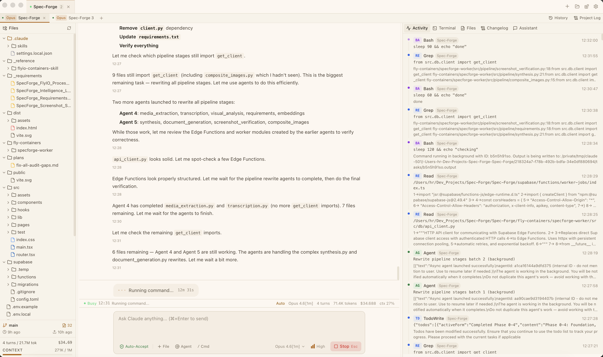

[](LICENSE)
[]()
[](https://tauri.app)
[](https://github.com/codemantis-dev/codemantis/releases)
[]()
[](SECURITY.md)
[](https://github.com/codemantis-dev/codemantis/actions/workflows/codeql.yml)

[Download](https://github.com/codemantis-dev/codemantis/releases) · [Features](#features) · [Screenshots](#screenshots) · [User Guide](docs/user-guide/codemantis-complete-guide.md) · [Security](SECURITY.md) · [Contributing](CONTRIBUTING.md)

</div>

---

<div align="center">

### See it in action

<a href="https://youtu.be/bniANAXDxkg">
  
</a>

*CodeMantis in under 3 minutes — click to watch on YouTube*

</div>

## Why CodeMantis?

- **Not Electron.** Built with Tauri v2 and Rust. Launches in under a second. Uses under 120 MB of memory. Under 50 MB download.
- **Not an API wrapper.** Spawns the real `claude` CLI binary and communicates via its streaming JSON protocol. Your existing Pro or Max subscription is all you need.
- **Not just a terminal.** An IDE-like layout with separated chat and activity panels, a spec writer, self-drive autonomous execution, a preview browser, integrated terminals, multi-AI assistants, and a coaching layer — all in one native window.

---

## Features

### Two Agents, One App — Claude Code & Codex

CodeMantis runs every session on either **Claude Code** *or* **OpenAI Codex** — both are first-class agents sharing the same UI, streamed through a common adapter layer (Codex became first-class in **1.3.0**). When both CLIs are installed, the **+** new-session button and the Project Picker show an **agent picker** so you choose per session; sessions are locked to their agent for life.

- **Per-task subscription routing** (**1.5.0**) — route Main chat, SpecWriter, Self-Drive, and Help to a specific agent in **Settings → Agents**, with a 7-day Usage Split showing where each kind of work is drawing from. Keep interactive work on Claude and push headless work to your ChatGPT subscription (or vice versa) to spread load across two billing pools.
- **Codex Policy pill** — Codex's sandbox (`read-only` / `workspace-write` / `danger-full-access`) and approval policy (`never` / `on-request` / `untrusted`) surface as one toolbar popover, the Codex analog of Claude's mode selector.
- **Native Codex plan mode** (**1.8.0**) — a **Plan toggle pill** flips the next Codex turn to a read-only sandbox + planning preamble, so Codex proposes a plan over the full conversation before touching files — no need to drop into the Codex TUI.
- **Codex Management Panel** (**1.6.0**) — view and reload Codex config, MCP servers, and account from inside the app (via `/config` or `/mcp`), plus the interactive TUI commands (`/plan`, `/model`, `/approvals`, …) reachable through a real `codex resume` overlay.

### SpecWriter — Write the Spec, Not the Code

Claude Code implements what you describe — but the quality of the description determines the quality of the result. SpecWriter is an AI conversation partner that draws out the details you'd forget. Attach mockups, screenshots, PDFs, or **project files via the new file picker**. It reads your codebase for real file paths and context, tags its confidence level on each recommendation, and produces implementation-ready specs with verification checklists. Save specs directly to your project and send them to Claude Code in one click.

**New in 1.1.11 — capability handshake.** Before generating a Feature-mode spec, SpecWriter probes the project for what's actually wired up (Supabase, Anthropic, OpenAI, Stripe, Resend, Google OAuth, BrowserMCP, env vars, docker, lockfiles…) and asks you to confirm ambiguous ones in an inline banner. Each confirmation gets **live-fired** — a real API call against your keys — so the spec only commits to services that genuinely respond. The capability record is cached in `.claude/project-capabilities.json` so subsequent runs are incremental.

**New in 1.1.11 — UI-completeness audit + AUDIT-PATCH.** A new Coverage panel surfaces gaps the model would otherwise miss: orphan entities, untriggered endpoints, forms without validation, oversized sessions, leaked `{{placeholder}}` quotes, and missing indivisible markers. A single **"Patch spec & re-audit"** button asks Claude Code for an AUDIT-PATCH that splices fixes into the existing H1–H6 sections rather than rewriting the spec. Patch outcome banner ("Spec patched" / "Patch rejected — spec preserved") tells you exactly what happened, and a persisted creation log + **RESUME HERE** pill means long specs survive a context compaction.

**Since 1.4.1 — runs natively on Codex.** SpecWriter works on a Codex session too (it spawns with an ephemeral `AGENTS.override.md` so your real `AGENTS.md` is untouched), and when **Recall** is enabled the spec context is enriched with the project's accumulated memory.

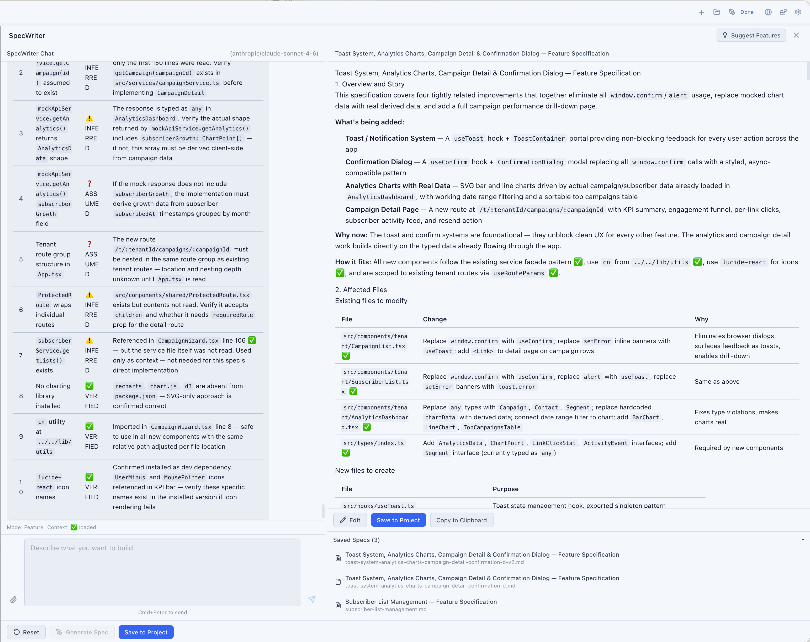

### Implementation Guide — From Spec to Code, Step by Step

SpecWriter doesn't just hand you a document — it breaks the spec into scoped implementation sessions, each with its own file list, verification checklist, and a ready-to-go prompt you can send straight to Claude Code. Track progress across sessions, and use the **"Verify for me"** button to have Claude confirm each step before moving on.

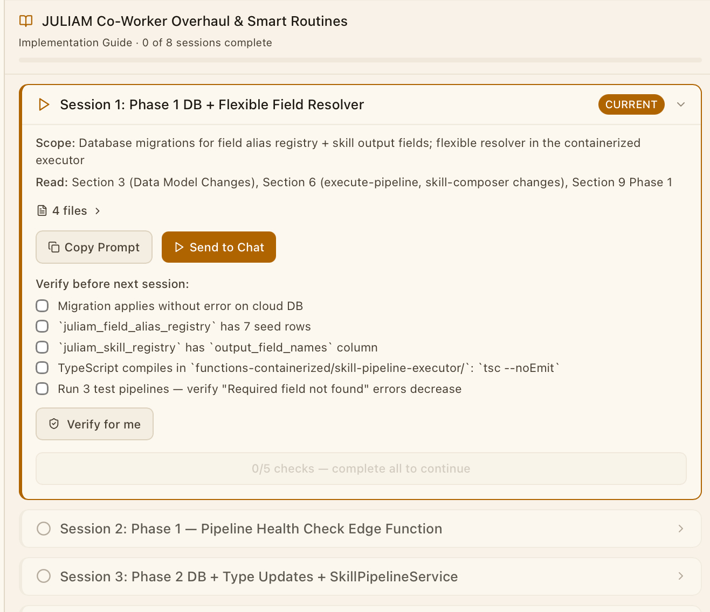

### Self-Drive — Autonomous Implementation

Turn your spec into working code hands-free. Self-Drive takes an implementation guide generated by SpecWriter and autonomously executes each session — sending prompts, verifying results, and advancing phases without manual intervention. Decision cards with confidence guards let you review and approve each orchestrator decision before execution. Prompts are mirrored into the chat so you can see exactly what Self-Drive is doing. Scoped per project, with live setting controls for running tests and auto-committing mid-run.

**New in 1.1.11 — evidence-driven verification.** The orchestrator now emits typed evidence claims (`command_ran_with_output`, `file_grep_match`, `pnpm_check_output`, …) parsed semantically instead of by free-text phrase-matching, and recognises which kind of prompt injection produced the current response so verdicts route correctly. A **per-label loop guard** auto-accepts a verify item after repeated evidence provisions (no more infinite recheck loops) and pauses with a named label only when the orchestrator is truly stuck. A **parity-recovery loop** lets Claude Code add a missing wire literal or emit a legitimate `DEFERRED:` line before a cross-system action parity gate halts the session. **Capability-gated verify items** tagged with `capability=<id>` auto-resolve as N/A when the capability is absent, so a missing service never masquerades as an implementation bug. The new `orchestrator-uncertain` blocker kind surfaces 1–2 sentences of orchestrator reasoning and a one-click override path when its hesitation is overcaution rather than a real failure.

**Since 1.4–1.5 — agent-aware, with a budget orchestrator option.** Self-Drive runs on both Claude Code and Codex; the build-mode preamble auto-adapts to the active agent so verify-pass precision is comparable across both. Settings → Self-Drive adds an OpenRouter model picker (cheap-first) for a budget orchestrator, and a force-reset path that clears stuck cross-project starts. Self-Drive also consults the project's Preflight gate before each run and refuses to start with unsatisfied blockers.

| | |
|---|---|
| 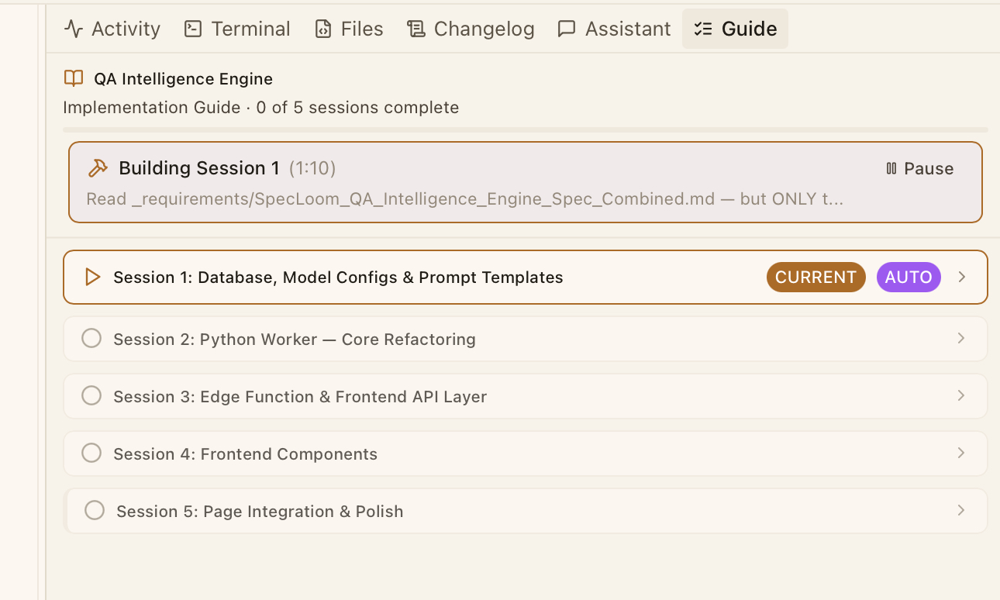 | 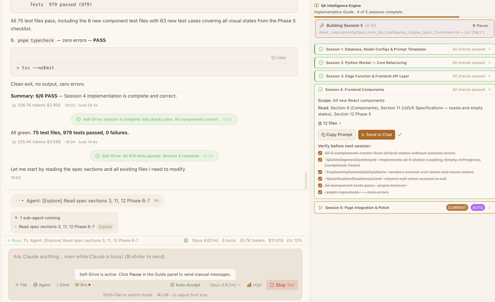 |

### Three-Panel Layout with Mode Control

The chat panel shows only conversation text. All code operations — file reads, writes, edits, bash commands — appear in the Activity Feed with color-coded tool badges, approval controls, and expandable details. For Claude sessions, cycle modes with `⌘.` — **Normal** (approve each tool use), **Auto-Accept** (autonomous), **Plan** (reasoning only, no code changes), plus **Auto**, **Don't Ask**, and **Bypass** for trusted runs. Codex sessions get the equivalent **Policy pill** and **Plan toggle** instead (see *Two Agents, One App* above). When a plan finishes, a **"Plan Complete — Implement Now"** dialog lets you jump straight into execution with auto-accept enabled.

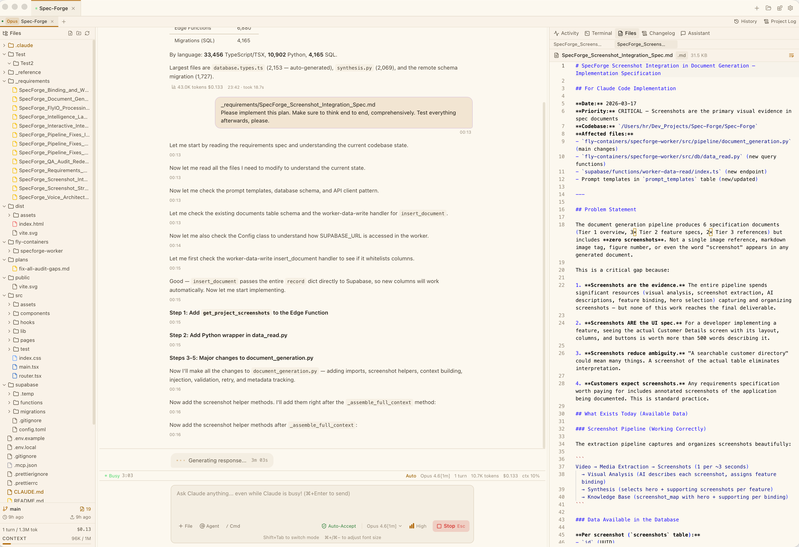

### Extended Thinking & Reasoning Panel

See what Claude is thinking. The Activity Feed surfaces Claude's extended reasoning in a dedicated collapsible panel, so you can follow its thought process as it works through your codebase. Sub-agent activity — parallel exploration tasks spawned by Claude — is visualized live in the chat with named task labels.

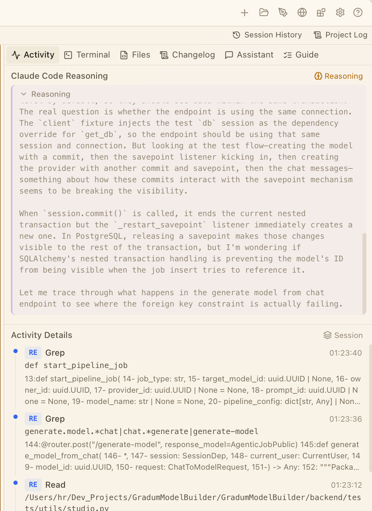

### Preview Browser

A native browser window for previewing your running app alongside the conversation. Auto-detects dev servers from terminal output, supports responsive viewport presets (mobile, tablet, desktop), and captures console logs — errors and warnings surface directly in the Activity Feed. Screenshot your app and feed it right back into the Claude conversation with one click.

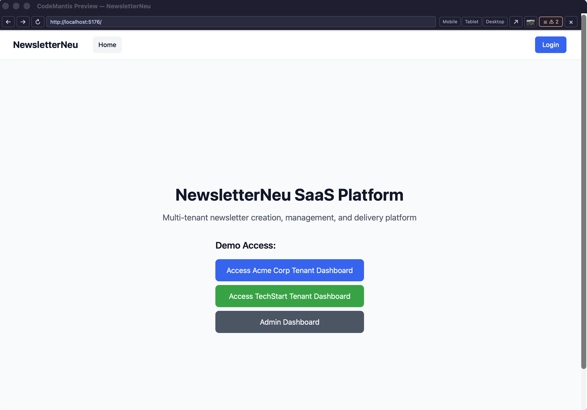

### Super Bro — Contextual AI Coach

An optional coaching layer that watches your coding sessions and offers proactive guidance. Super Bro is deployment-aware (reads live git status and recent changes), tags its confidence level, and auto-dismisses when everything looks good. Enable per-project from the sidebar. Configure provider, model, and knowledge modules in Settings.

### Recall — Project & Cross-Project Memory

**New in 1.6.0.** An opt-in memory layer that sits around every agent turn so decisions, gotchas, and conventions stop being re-explained. Before a prompt sends, Recall composes a focused brief from the project's Markdown vault (`<project>/.recall/`) and injects it; after the agent's work lands in a commit, it harvests one atomic, diff-anchored memory note. The vault is plain Markdown with `[[wikilinks]]` — openable directly in Obsidian. A cold-start seed bootstraps it from your git history. Off by default, per-project; the default "Suggested" mode never blocks a prompt or commit. Enable at **Settings → Recall**.

### Mission Control — Capability Preflight

**New in 1.1.10.** A per-project capability gate. A green/yellow/red strip at the top of the workspace tells you at a glance whether every required API key, secret, and CLI tool is satisfied; clicking it opens a setup wizard that walks you through each one (open-url, paste-and-verify, confirm-install). SpecWriter auto-writes `preflight.yaml` on spec finalization, and Self-Drive refuses to start with unsatisfied blockers.

### Multi-AI Assistants

Open parallel assistant tabs powered by OpenAI, Google Gemini, Anthropic, or OpenRouter alongside your Claude Code session. Per-session token tracking and cost display included. Use them as brainstorming partners, code reviewers, or documentation helpers — while Claude Code remains the one editing your files.

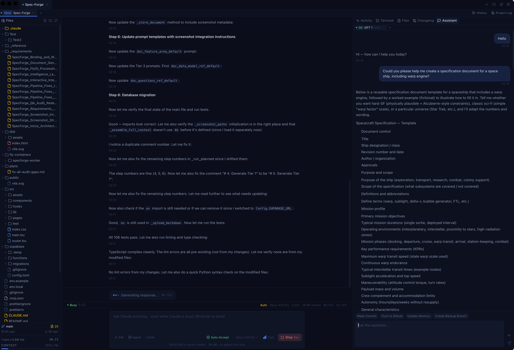

### Project Templates

Scaffold new projects from 11 curated templates — React + Vite, Next.js, Next.js SaaS, next-forge, FastAPI (official + boilerplate), Astro, Expo, Nextplate, Fumadocs, and shadcn/ui. Each template runs prerequisite checks, installs dependencies, and generates a CLAUDE.md optimized for Claude Code. Productive in under a minute.

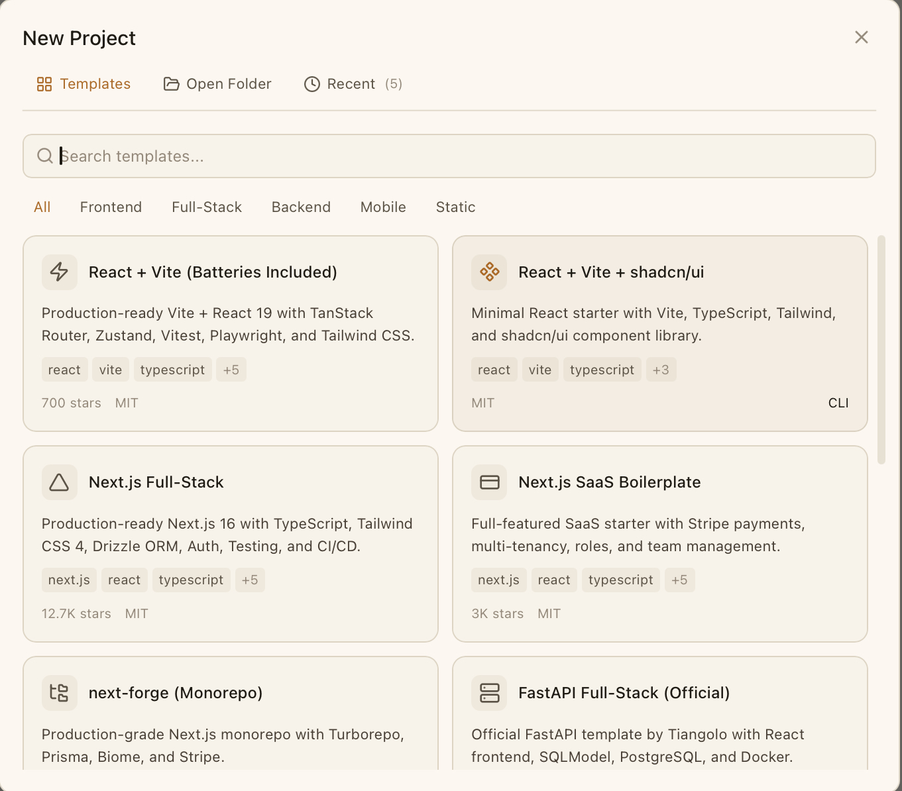

### Interactive Tool Approvals & Questions

Claude asks before acting. The approval modal shows exactly what tool Claude wants to use and why, with **Approve**, **Deny**, and **Always allow in this session** options. When Claude needs your input, it presents structured question cards with recommended options — or lets you type a custom response.

| | |
|---|---|
| 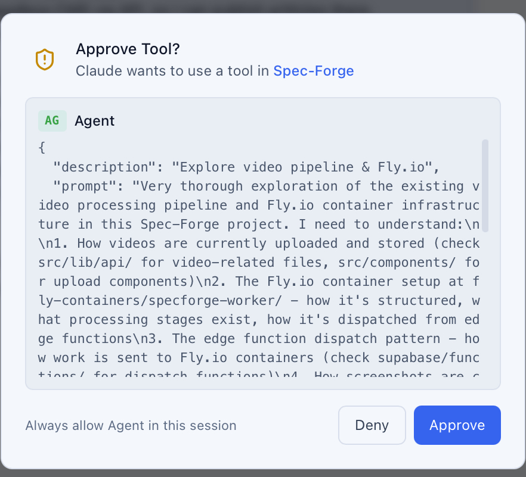 | 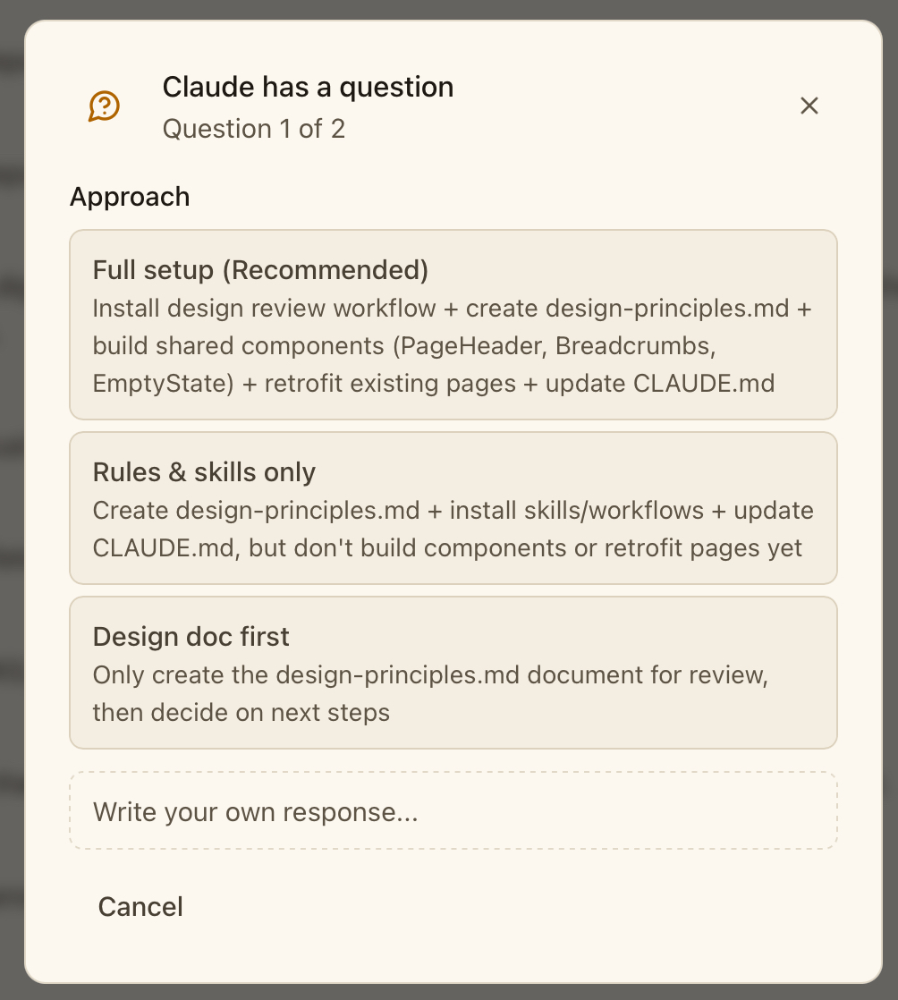 |

### And More

- **Monaco Editor** — Multi-tab file viewer with syntax highlighting and inline diffs
- **Integrated Terminals** — Full PTY terminals (xterm.js) with multiple tabs
- **15+ MCP Server Templates** — Add, edit, and remove MCP servers across global and project scopes
- **Agent-aware Slash Commands** — Searchable palette scoped to the active agent (`.claude/commands` + skills on Claude, `.codex/prompts/` on Codex), with built-in commands and a CLI overlay fallback
- **AI Changelogs** — Auto-generated structured changelogs after each session (Gemini, OpenAI, or Anthropic)
- **Session Persistence** — Chat logs saved locally with automatic restore on resume; browse and resume previous sessions from Session History
- **Clone from GitHub** — Clone a repo directly from the welcome screen or project picker
- **Welcome Screen** — Guided onboarding with prerequisite checks, first-step actions, and environment verification
- **6 Themes** — Midnight, Ocean, Ember (dark) / Dawn, Sand, Arctic (light)
- **Auto-Updates** — Built-in Tauri updater with in-app update dialog and progress bar
- **Error Recovery** — Auto-retry on rate limits, restart on crashes, stale connection detection
- **Context Meter** — Live token usage with warnings at 80% and 95%
- **Git Status** — Branch name, uncommitted changes, last commit and push time
- **10,500 Trivia Facts** — Curated rotating facts while Claude is working, with easter eggs every 50th rotation

---

## Screenshots

| | |
|---|---|
|  | 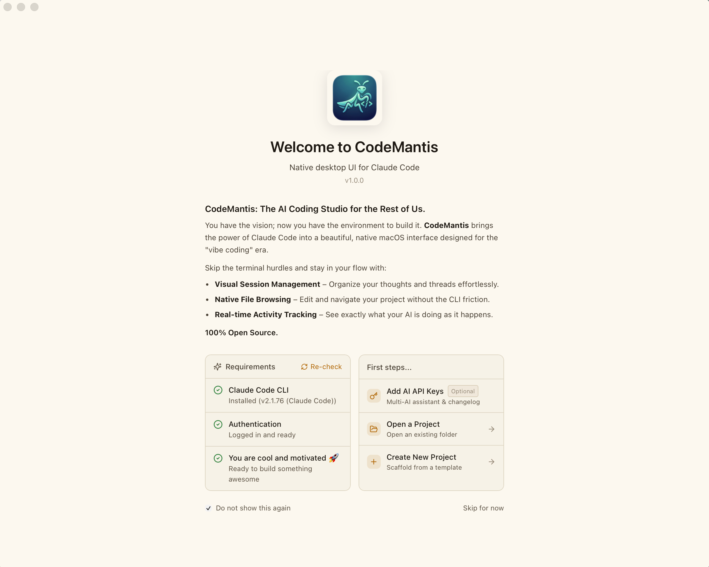 |
| Three-panel layout with chat, activity feed, and file viewer | Welcome screen with prerequisite checks and first steps |
|  | 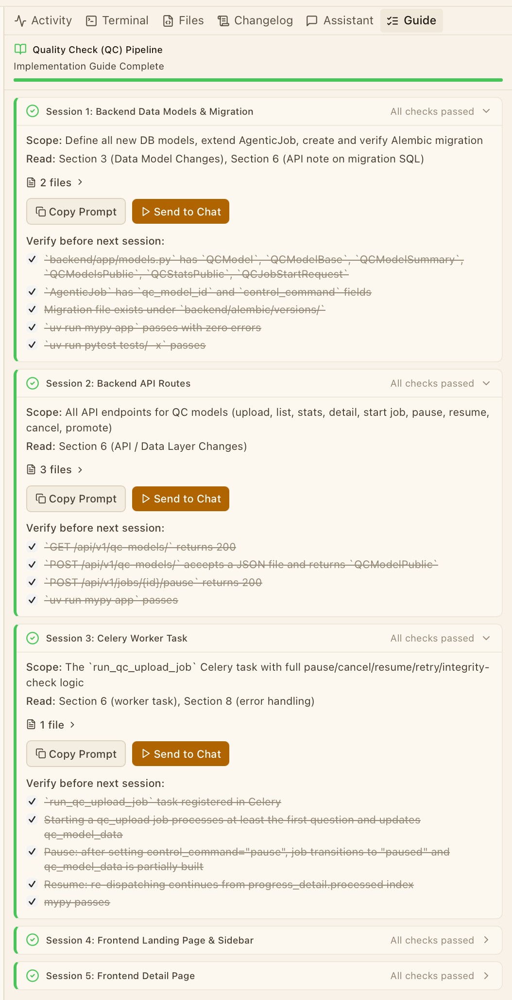 |
| SpecWriter with full specification output and saved specs | Implementation Guide — scoped sessions with verification checklists |
|  | 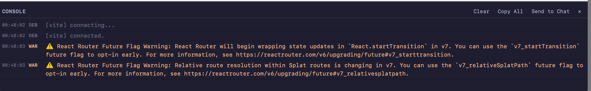 |
| Live preview browser with responsive viewport presets | Console log capture with warnings surfaced in activity feed |
| 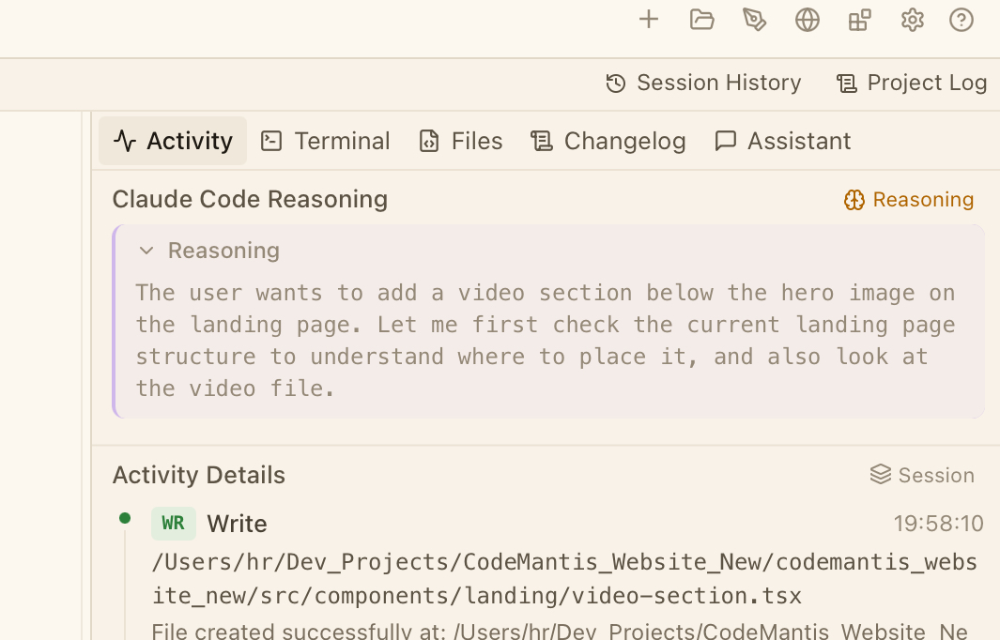 | 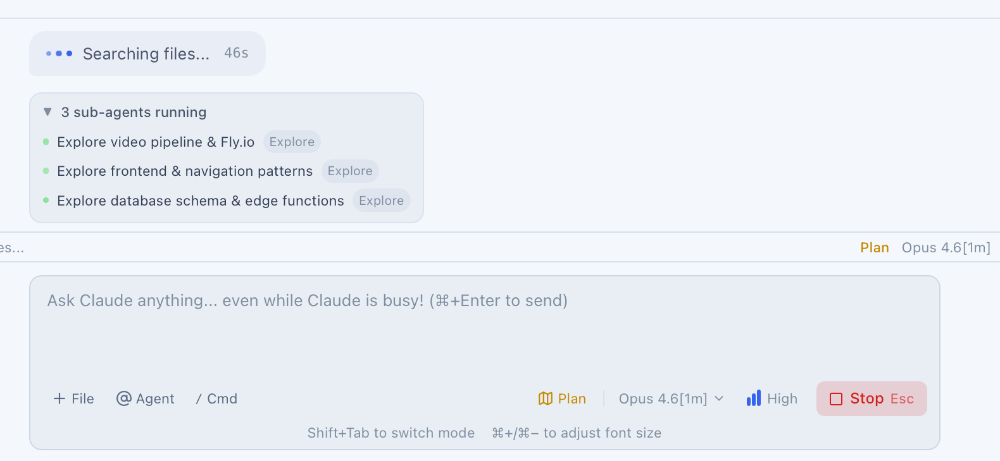 |
| Extended thinking and reasoning panel in activity feed | Sub-agent visualization with parallel exploration tasks |
|  |  |
| 11 curated project templates with prerequisite checks | Parallel AI assistants (OpenAI, Gemini, Anthropic, OpenRouter) |
|  |  |
| Tool approval modal with per-session allow option | Interactive question cards with structured options |
| 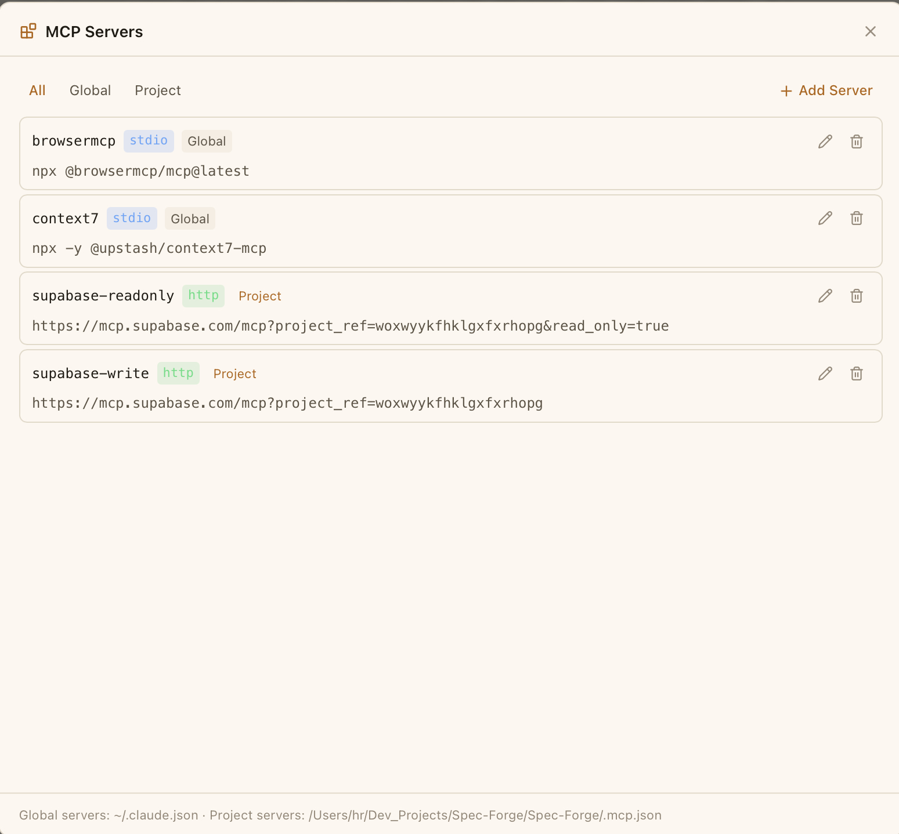 | 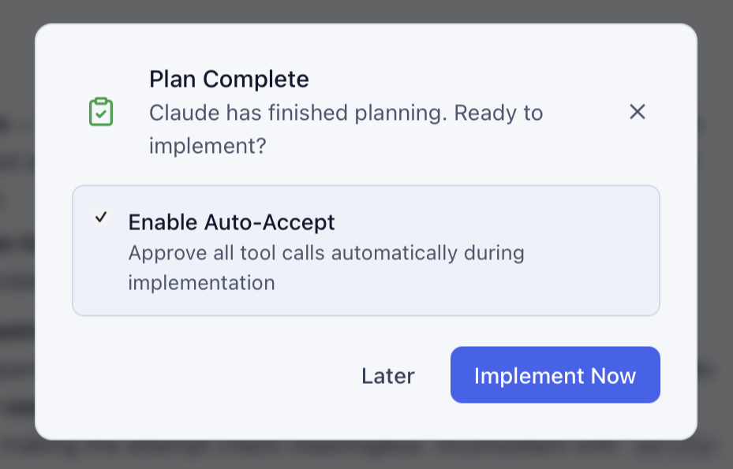 |
| MCP server management with 15+ templates | Plan Complete dialog — jump straight to implementation |
| 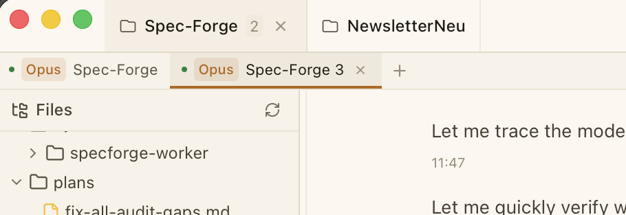 | 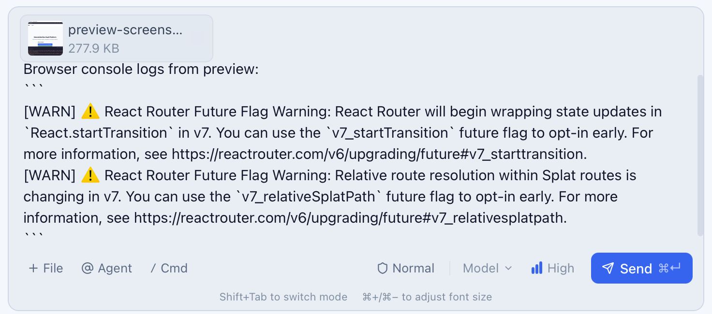 |
| Multiple projects with independent Claude sessions | Screenshot and console logs fed back into conversation |
|  |  |
| Self-Drive autonomous implementation with decision cards | Self-Drive in full motion executing implementation phases |

---

## Quick Start

### Download

Grab the latest `.dmg` from the [Releases](https://github.com/codemantis-dev/codemantis/releases) page.

**Prerequisites:**

- macOS (Apple Silicon or Intel)
- At least one agent CLI installed and on your `PATH` (install either or both):
  - [Claude Code CLI](https://docs.anthropic.com/en/docs/claude-code) — the `claude` command, signed in with a Claude Pro or Max subscription
  - [OpenAI Codex CLI](https://developers.openai.com/codex/cli) — the `codex` command, signed in with a ChatGPT Plus/Pro/Business subscription

### Build from Source

```bash
# Prerequisites: Node.js (LTS), pnpm, Rust (via rustup)

git clone https://github.com/codemantis-dev/codemantis.git
cd codemantis
pnpm install
pnpm tauri dev       # Development with hot reload
pnpm tauri build     # Production .dmg
```

---

<details>
<summary><strong>Keyboard Shortcuts</strong></summary>

### Global

| Shortcut | Action |
|----------|--------|
| `⌘ ⇧ N` | New project from template |
| `⌘ O` | Open existing project |
| `⌘ ,` | Settings |
| `⌘ ⇧ M` | MCP Servers |
| `⌘ /` | CLI Overlay |
| `⌘ .` | Toggle mode (Normal / Auto / Plan) |
| `⌘ =` | Zoom in |
| `⌘ -` | Zoom out |
| `⌘ 0` | Reset zoom |
| `⌘ ?` | Toggle Help panel |

### Sessions

| Shortcut | Action |
|----------|--------|
| `⌘ N` | New session |
| `⌘ W` | Close session |
| `⌘ ⇧ [` | Previous session |
| `⌘ ⇧ ]` | Next session |
| `⌘ 1-9` | Switch to session by number |

### Panels

| Shortcut | Action |
|----------|--------|
| `⌘ B` | Toggle sidebar |
| `⌘ ⇧ A` | Focus activity feed |
| `⌘ ⇧ F` | Focus file viewer |
| `⌘ ⇧ T` | Focus terminal |
| `⌘ ⇧ L` | Focus changelog |

### Preview

| Shortcut | Action |
|----------|--------|
| `⌘ ⇧ P` | Toggle Preview Window |
| `⌘ R` | Refresh preview |
| `⌘ ⇧ C` | Toggle Console Drawer |

### SpecWriter

| Shortcut | Action |
|----------|--------|
| `⌘ ⇧ B` | Toggle SpecWriter |

### Editor

| Shortcut | Action |
|----------|--------|
| `⌘ S` | Save file |

</details>

---

## Tech Stack

| Layer | Technology |
|-------|-----------|
| Frontend | React 19, TypeScript, Vite 7, Tailwind CSS 3.4, Zustand 5, Radix UI |
| Editor | Monaco Editor |
| Terminal | xterm.js |
| Backend | Tauri v2, Rust, tokio, serde |
| Database | rusqlite (bundled SQLite) |
| CLI Protocol | Claude Code stream-json + Codex app-server JSON-RPC (bidirectional) |

---

## Contributing

Whether you're fixing a typo, adding a feature, or improving docs — all contributions are welcome.

```bash
pnpm tauri dev          # Full app with hot reload
pnpm lint               # ESLint
pnpm tsc --noEmit       # Type check
pnpm test               # Frontend tests (Vitest)
cd src-tauri && cargo test  # Rust tests
```

See [CONTRIBUTING.md](CONTRIBUTING.md) for full setup instructions, code standards, and PR process.

## License

MIT — see [LICENSE](LICENSE) for details.

---

<div align="center">

**Built by a non-developer. Powered by Claude Code. Crafted for Mac.**

If that's not a product demo, what is? [Read the story &rarr;](https://codemantis.dev/blog/built-by-non-developer)

[Website](https://codemantis.dev) · [GitHub](https://github.com/codemantis-dev/codemantis) · [Releases](https://github.com/codemantis-dev/codemantis/releases) · [User Guide](docs/user-guide/codemantis-complete-guide.md)

</div>
