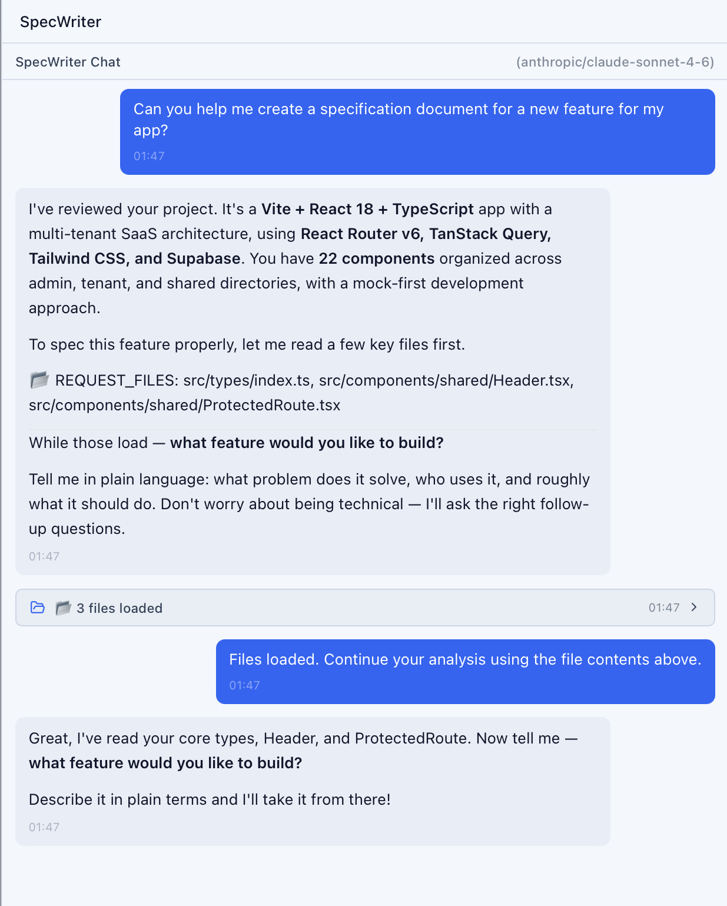

<div align="center">

# CodeMantis

### The Mac app Claude Code deserves

A free, open-source native macOS application that gives Claude Code a three-panel graphical interface — chat, activity feed, file viewer, terminals, and more.

**Uses your existing Claude Pro/Max subscription. No API key needed.**


[](LICENSE)
[]()
[](https://tauri.app)
[](https://github.com/codemantis-dev/codemantis/releases)
[]()

[Website](https://codemantis.netlify.app/) · [Download](https://github.com/codemantis-dev/codemantis/releases) · [Features](#features) · [Screenshots](#screenshots) · [Contributing](CONTRIBUTING.md)

</div>

---

## Why CodeMantis?

- **Not Electron.** Built with Tauri v2 and Rust. Launches in under a second. Uses under 120 MB of memory. Under 30 MB download.
- **Not an API wrapper.** Spawns the real `claude` CLI binary and communicates via its streaming JSON protocol. Your existing Pro or Max subscription is all you need.
- **Not just a terminal.** A three-panel IDE-like layout with separated chat and activity panels, a file viewer, integrated terminals, and multi-AI assistants — all in one native window.

---

## Features

### SpecWriter — Write the Spec, Not the Code

Claude Code implements what you describe — but the quality of the description determines the quality of the result. SpecWriter is an AI conversation partner that draws out the details you'd forget. Attach mockups, screenshots, or PDFs. It reads your codebase for real file paths and context, tags its confidence level on each recommendation, and produces implementation-ready specs with verification checklists.



### Three-Panel Layout with Mode Control

The chat panel shows only conversation text. All code operations — file reads, writes, edits, bash commands — appear in the Activity Feed with color-coded tool badges, approval controls, and expandable details. Switch between **Normal** (approve each tool use), **Auto-Accept** (let Claude work autonomously), and **Plan** (reasoning only, no code changes) with `⌘.`.


### Project Templates

Scaffold new projects from 11 curated templates — React + Vite, Next.js, Next.js SaaS, next-forge, FastAPI (official + boilerplate), Astro, Expo, Nextplate, Fumadocs, and shadcn/ui. Each template runs prerequisite checks, installs dependencies, and generates a CLAUDE.md optimized for Claude Code. Productive in under a minute.


### Preview Browser

A native browser window for previewing your running app alongside the conversation. Auto-detects dev servers from terminal output, supports responsive viewport presets, and captures console logs — errors and warnings surface directly in the Activity Feed. You can screenshot your app and feed it right back into the Claude conversation.


### Multi-AI Assistants

Open parallel assistant tabs powered by OpenAI, Google Gemini, or Anthropic APIs alongside your Claude Code session. Per-session token tracking and cost display included. Use them as brainstorming partners, code reviewers, or documentation helpers — while Claude Code remains the one editing your files.


### And More

- **Monaco Editor** — Multi-tab file viewer with syntax highlighting and inline diffs
- **Integrated Terminals** — Full PTY terminals (xterm.js) with multiple tabs
- **15+ MCP Server Templates** — Add, edit, and remove MCP servers across global and project scopes
- **Slash Commands** — Searchable command palette with skill templates, built-in commands, and CLI fallback
- **AI Changelogs** — Auto-generated structured changelogs after each session (Gemini, OpenAI, or Anthropic)
- **6 Themes** — Midnight, Ocean, Ember (dark) / Dawn, Sand, Arctic (light)
- **Session History** — Resume previous Claude Code conversations
- **Auto-Updates** — Built-in Tauri updater with in-app notifications
- **Error Recovery** — Auto-retry on rate limits, restart on crashes, stale connection detection
- **Context Meter** — Live token usage with warnings at 80% and 95%
- **Git Status** — Branch name, uncommitted changes, last commit and push time

---

## Screenshots

| | |
|---|---|
|  |  |
| Three-panel layout with chat, activity feed, and file viewer | SpecWriter AI dialogue for implementation specs |
|  |  |
| 11 curated project templates with prerequisite checks | Live preview browser with console log capture |
|  |  |
| Parallel AI assistants (OpenAI, Gemini, Anthropic) | MCP server management with 15+ templates |

---

## Quick Start

### Download

Grab the latest `.dmg` from the [Releases](https://github.com/codemantis-dev/codemantis/releases) page.

**Prerequisites:**

- macOS (Apple Silicon or Intel)
- [Claude Code CLI](https://docs.anthropic.com/en/docs/claude-code) installed and signed in with a Claude Pro or Max subscription
- The `claude` command must be on your `PATH`

### Build from Source

```bash
# Prerequisites: Node.js (LTS), pnpm, Rust (via rustup)

git clone https://github.com/codemantis-dev/codemantis.git
cd codemantis
pnpm install
pnpm tauri dev       # Development with hot reload
pnpm tauri build     # Production .dmg
```

---

<details>
<summary><strong>Keyboard Shortcuts</strong></summary>

### Global

| Shortcut | Action |
|----------|--------|
| `⌘ ⇧ N` | New project from template |
| `⌘ O` | Open existing project |
| `⌘ ,` | Settings |
| `⌘ ⇧ M` | MCP Servers |
| `⌘ /` | CLI Overlay |
| `⌘ .` | Toggle mode (Normal / Auto / Plan) |
| `⌘ =` | Zoom in |
| `⌘ -` | Zoom out |
| `⌘ 0` | Reset zoom |
| `⌘ ?` | Toggle Help panel |

### Sessions

| Shortcut | Action |
|----------|--------|
| `⌘ N` | New session |
| `⌘ W` | Close session |
| `⌘ ⇧ [` | Previous session |
| `⌘ ⇧ ]` | Next session |
| `⌘ 1-9` | Switch to session by number |

### Panels

| Shortcut | Action |
|----------|--------|
| `⌘ B` | Toggle sidebar |
| `⌘ ⇧ A` | Focus activity feed |
| `⌘ ⇧ F` | Focus file viewer |
| `⌘ ⇧ T` | Focus terminal |
| `⌘ ⇧ L` | Focus changelog |

### Preview

| Shortcut | Action |
|----------|--------|
| `⌘ ⇧ P` | Toggle Preview Window |
| `⌘ R` | Refresh preview |
| `⌘ ⇧ C` | Toggle Console Drawer |

### SpecWriter

| Shortcut | Action |
|----------|--------|
| `⌘ ⇧ B` | Toggle SpecWriter |

### Editor

| Shortcut | Action |
|----------|--------|
| `⌘ S` | Save file |

</details>

---

## Tech Stack

| Layer | Technology |
|-------|-----------|
| Frontend | React 19, TypeScript, Vite 7, Tailwind CSS 3.4, Zustand 5, Radix UI |
| Editor | Monaco Editor |
| Terminal | xterm.js |
| Backend | Tauri v2, Rust, tokio, serde |
| Database | rusqlite (bundled SQLite) |
| CLI Protocol | Claude Code stream-json (bidirectional) |

---

## Contributing

Whether you're fixing a typo, adding a feature, or improving docs — all contributions are welcome.

```bash
pnpm tauri dev          # Full app with hot reload
pnpm lint               # ESLint
pnpm tsc --noEmit       # Type check
pnpm test               # Frontend tests (Vitest)
cd src-tauri && cargo test  # Rust tests
```

See [CONTRIBUTING.md](CONTRIBUTING.md) for full setup instructions, code standards, and PR process.

## License

MIT — see [LICENSE](LICENSE) for details.

---

<div align="center">

**Built by a non-developer. Powered by Claude Code. Crafted for Mac.**

If that's not a product demo, what is?

[Website](https://codemantis.netlify.app/) · [GitHub](https://github.com/codemantis-dev/codemantis) · [Releases](https://github.com/codemantis-dev/codemantis/releases)

</div>
